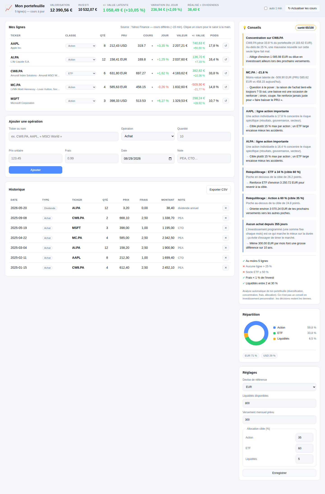

# 📈 Suivi de portefeuille — actions & ETF

Application web **locale** pour suivre un portefeuille boursier : tu saisis tes achats,
l'appli va chercher les cours et te dit où tu en es. Elle **ne passe aucun ordre** et
n'est reliée à aucun courtier — c'est un tableau de bord de suivi.



## Ce que ça fait

| | |
|---|---|
| **Saisie des opérations** | achats, ventes, dividendes — avec quantité, prix, frais, date et note (PEA / CTO…) |
| **Cours du marché** | Yahoo Finance (différé ~15 min, temps réel sur certaines places), repli Stooq, puis dernier cours en cache |
| **Cours manuel** | clique sur n'importe quel cours du tableau pour le saisir toi-même — pratique hors ligne ou pour un titre exotique |
| **Multi-devises** | tout est reconverti dans ta devise de référence au taux de change du jour |
| **Calculs** | PRU (frais inclus), valorisation, +/- value latente et réalisée, variation du jour, dividendes encaissés, poids de chaque ligne |
| **Encadré conseils** | analyse automatique : concentration, diversification, exposition devise, rééquilibrage vers ton allocation cible, frais, régularité des versements + un score de santé /100 |
| **Répartition** | camembert par classe d'actif et répartition par devise |
| **Export** | historique complet en CSV |

Toutes les données restent dans `data/portfolio.json`, sur ta machine. Rien n'est envoyé
ailleurs (les seules requêtes sortantes servent à récupérer les cours).

## Installation

```bash
cd portfolio_tracker
pip install -r requirements.txt
python app.py
```

Puis ouvre **http://localhost:5001**

## Utilisation

### 1. Ajouter une ligne
Dans « Ajouter une opération », tape le nom ou le ticker : l'autocomplétion propose les
tickers Yahoo, et le prix du jour est pré-rempli. Renseigne la quantité, le prix **payé**
(pas le prix actuel), les frais, puis valide.

Exemples de tickers :

| Support | Ticker |
|---|---|
| Amundi MSCI World (Euronext Paris) | `CW8.PA` |
| iShares Core MSCI World (Amsterdam) | `IWDA.AS` |
| Air Liquide | `AI.PA` |
| LVMH | `MC.PA` |
| Apple | `AAPL` |
| Vanguard S&P 500 (Londres, en USD) | `VUSA.L` |

> Suffixe de place : `.PA` Paris · `.AS` Amsterdam · `.DE` Xetra · `.L` Londres ·
> `.MI` Milan · `.SW` Suisse · rien pour les États-Unis.

### 2. Mettre à jour les cours
Bouton **↻ Actualiser les cours** en haut à droite, ou coche `auto 1 min` pour un
rafraîchissement automatique. Les cours sont mis en cache 3 minutes pour ne pas
surcharger l'API.

Un cours qui ne remonte pas ? Clique dessus dans le tableau et saisis-le à la main
(il s'affiche alors avec ✎). Le bouton ↺ de la ligne revient au cours du marché.

### 3. Vendre / encaisser un dividende
Même formulaire, en changeant « Opération » :
- **Vente** : la plus-value réalisée est calculée par rapport au PRU et la position réduite.
- **Dividende** : saisis le montant par part (la quantité sert de multiplicateur).

### 4. Régler l'allocation cible
Dans « Réglages » : devise de référence, liquidités disponibles, versement mensuel prévu
et répartition cible en %. C'est cette cible qui alimente les conseils de rééquilibrage.

## Les conseils, comment ça marche

L'encadré applique des règles de gestion classiques à **ton** portefeuille — il ne prédit
rien et ne recommande aucun titre en particulier :

- une ligne > 25 % (ou une action individuelle > 15 %) → alerte de concentration ;
- moins de 5 lignes sans socle ETF → alerte de diversification ;
- plus de 70 % dans une devise étrangère → rappel du risque de change ;
- écart de plus de 5 points avec l'allocation cible → montant à rééquilibrer ;
- ligne à −20 % → revoir la thèse d'investissement ; ligne à +60 % qui pèse trop → écrêter ;
- frais > 1 % de l'investi, trop (ou pas assez) de liquidités, aucun achat depuis 3 mois.

Les seuils sont en haut de `advisor.py`, modifie-les selon ta stratégie.

## Architecture

```
portfolio_tracker/
├── app.py            # serveur Flask : pages + API JSON
├── store.py          # persistance (data/portfolio.json)
├── market.py         # cours Yahoo / Stooq, cache disque, taux de change
├── portfolio.py      # calcul des positions, PRU, P&L, répartition
├── advisor.py        # moteur de conseils + score de santé
├── templates/index.html
├── static/{style.css, app.js}   # interface, sans aucune dépendance externe
└── data/             # tes données (ignoré par git)
```

### API

| Route | Rôle |
|---|---|
| `GET /api/portfolio?refresh=1` | instantané complet (positions, totaux, conseils) |
| `POST /api/transactions` | ajouter une opération |
| `DELETE /api/transactions/<id>` | supprimer une opération |
| `POST /api/instruments/<ticker>` | classe d'actif, nom, cours manuel |
| `POST /api/settings` | devise, liquidités, allocation cible |
| `GET /api/search?q=` | recherche de ticker |
| `GET /api/quote/<ticker>` | cours d'un titre |
| `GET /api/export.csv` | export de l'historique |

## Limites connues

- Les cours Yahoo sont **différés** (~15 min) sur la plupart des places européennes ;
  pour du vrai temps réel il faut un abonnement de données payant.
- Pas d'authentification : l'appli écoute sur `127.0.0.1`, elle est faite pour tourner
  sur ta machine uniquement.
- La fiscalité (PEA, CTO, prélèvements) n'est pas calculée — le PRU suit la méthode du
  prix moyen pondéré, frais inclus.

---

*Outil de suivi personnel. Ce n'est pas un conseil en investissement : les décisions
d'achat et de vente restent les tiennes.*
